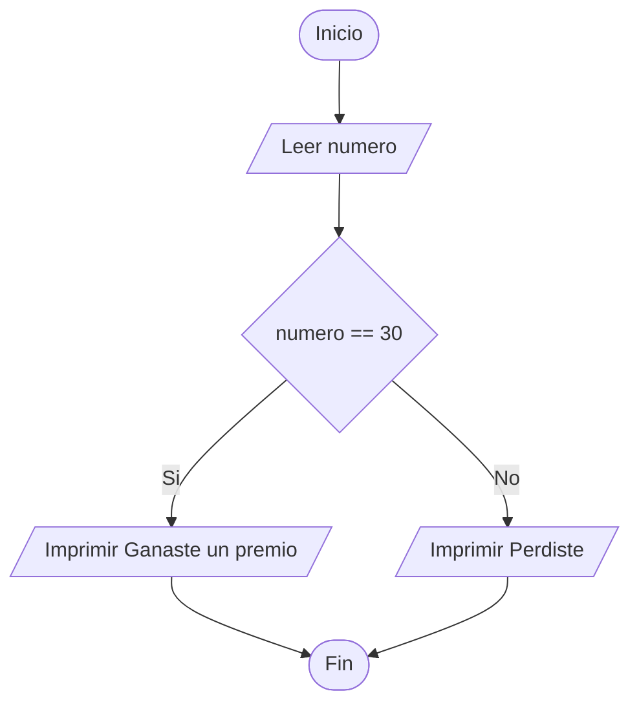
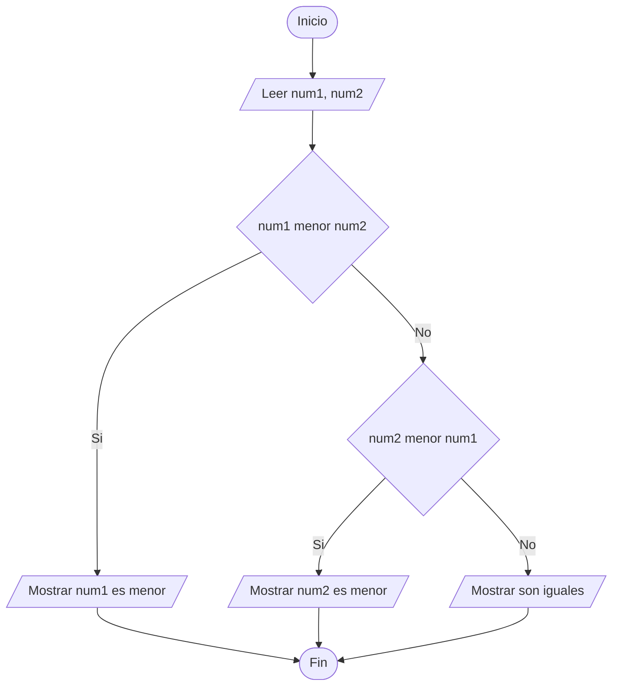
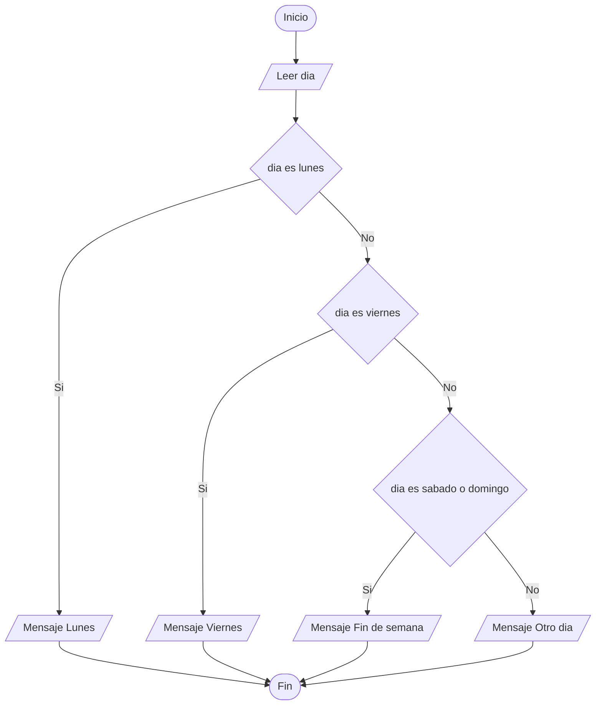
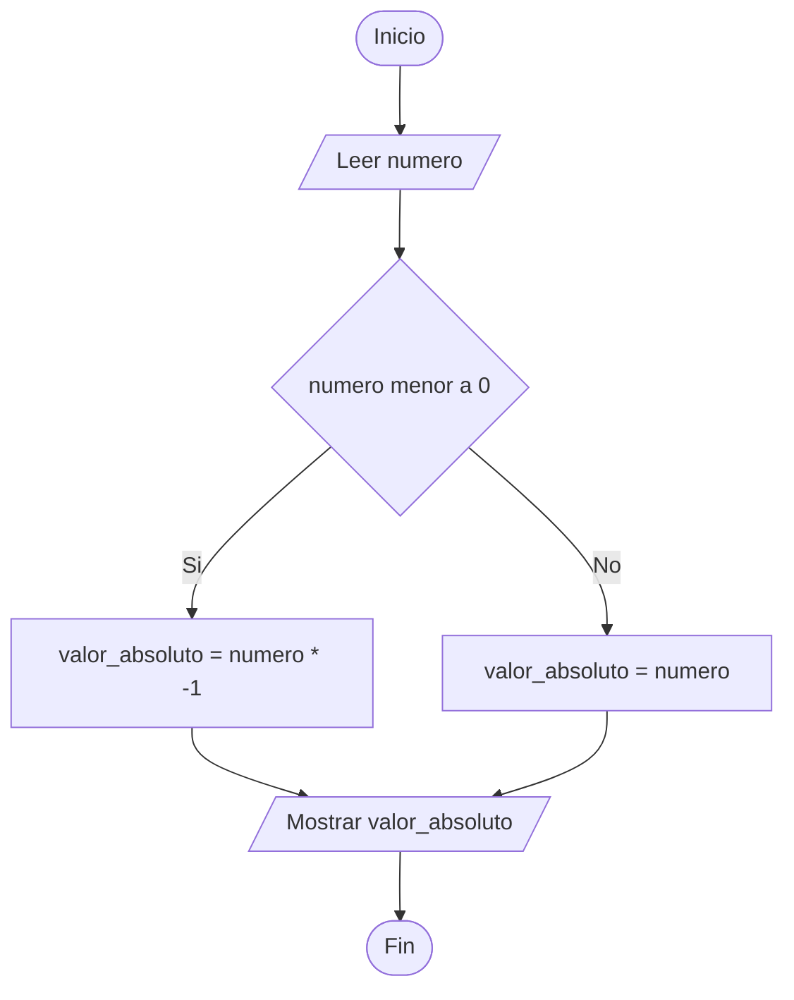
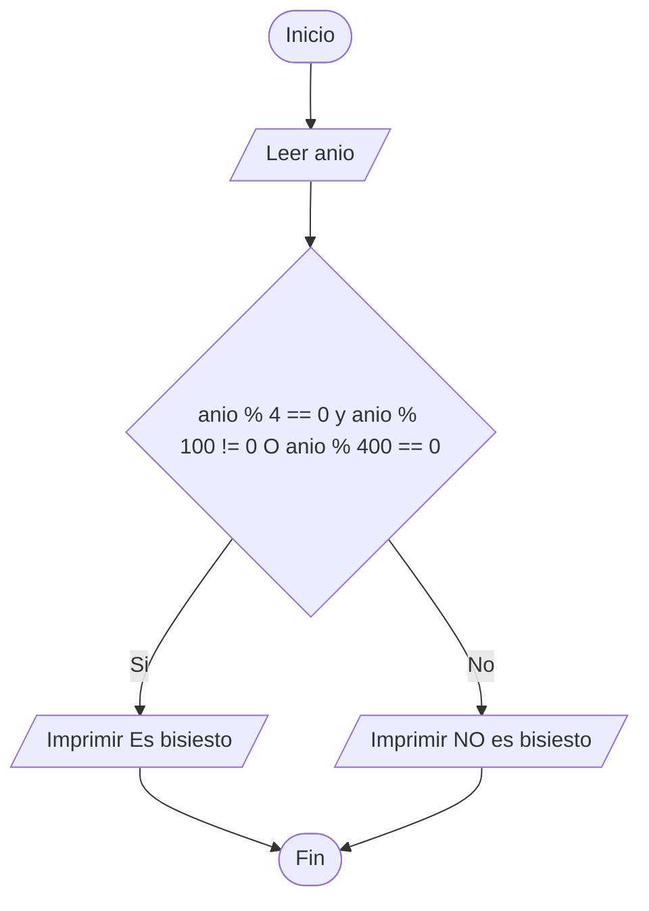
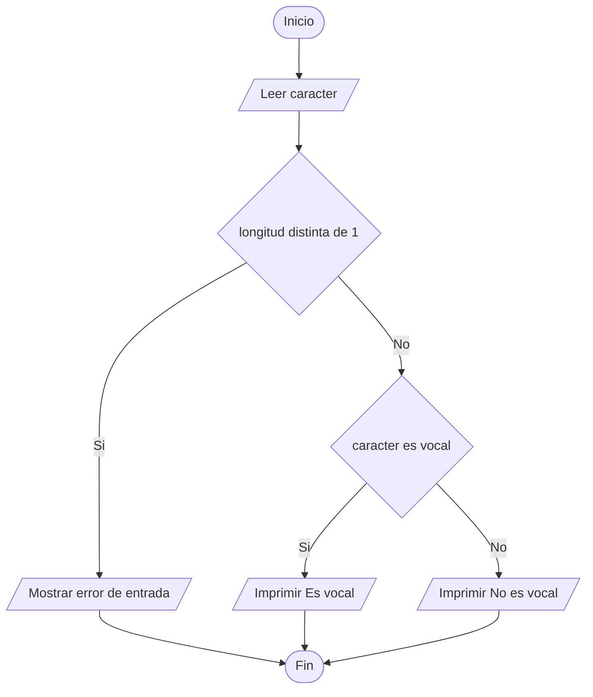
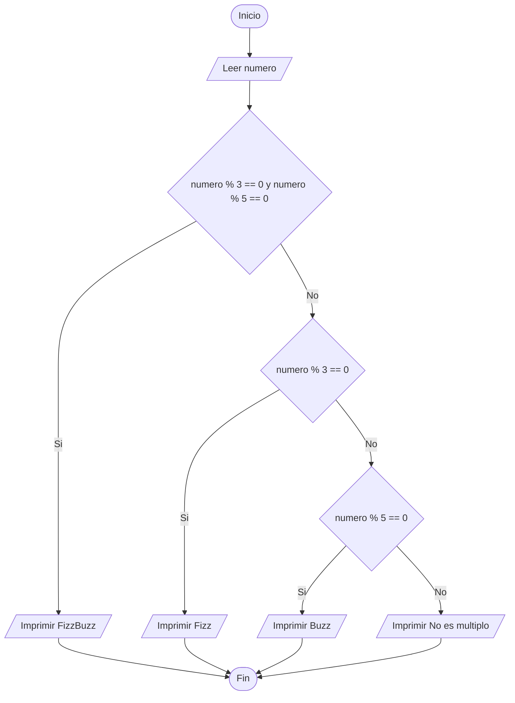
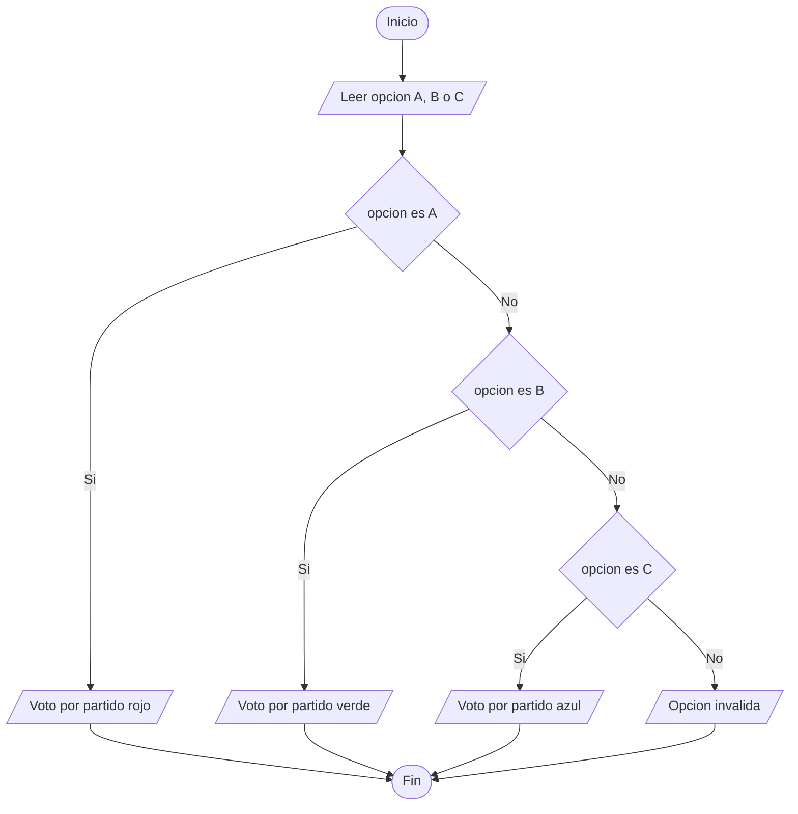
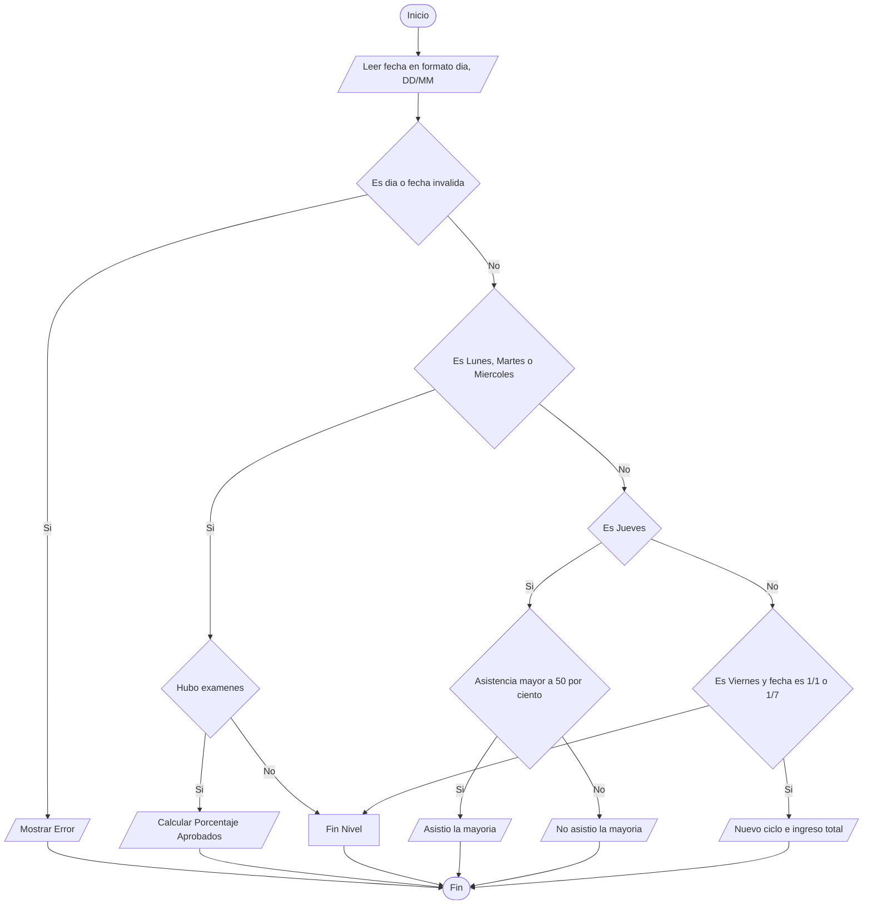

# Diagramas de Flujo - Taller Condicionales

## Ejercicio 1

```mermaid
graph TD
    A([Inicio]) --> B[/Leer numero/]
    B --> C{numero == 30}
    C -- Si --> D[/Imprimir Ganaste un premio/]
    C -- No --> E[/Imprimir Perdiste/]
    D --> F([Fin])
    E --> F
```

## Ejercicio 2

```mermaid
graph TD
    A([Inicio]) --> B[/Leer num1, num2/]
    B --> C{num1 menor num2}
    C -- Si --> D[/Mostrar num1 es menor/]
    C -- No --> E{num2 menor num1}
    E -- Si --> F[/Mostrar num2 es menor/]
    E -- No --> G[/Mostrar son iguales/]
    D --> H([Fin])
    F --> H
    G --> H
```

## Ejercicio 3

```mermaid
graph TD
    A([Inicio]) --> B[/Leer dia/]
    B --> C{dia es lunes}
    C -- Si --> D[/Mensaje Lunes/]
    C -- No --> E{dia es viernes}
    E -- Si --> F[/Mensaje Viernes/]
    E -- No --> G{dia es sabado o domingo}
    G -- Si --> H[/Mensaje Fin de semana/]
    G -- No --> I[/Mensaje Otro dia/]
    D --> J([Fin])
    F --> J
    H --> J
    I --> J
```

## Ejercicio 4

```mermaid
graph TD
    A([Inicio]) --> B[/Leer numero/]
    B --> C{numero menor a 0}
    C -- Si --> D[valor_absoluto = numero * -1]
    C -- No --> E[valor_absoluto = numero]
    D --> F[/Mostrar valor_absoluto/]
    E --> F
    F --> G([Fin])
```

## Ejercicio 5

```mermaid
graph TD
    A([Inicio]) --> B[/Leer anio/]
    B --> C{anio % 4 == 0 y anio % 100 != 0 O anio % 400 == 0}
    C -- Si --> D[/Imprimir Es bisiesto/]
    C -- No --> E[/Imprimir NO es bisiesto/]
    D --> F([Fin])
    E --> F
```

## Ejercicio 6

```mermaid
graph TD
    A([Inicio]) --> B[/Leer caracter/]
    B --> C{longitud distinta de 1}
    C -- Si --> D[/Mostrar error de entrada/]
    C -- No --> E{caracter es vocal}
    E -- Si --> F[/Imprimir Es vocal/]
    E -- No --> G[/Imprimir No es vocal/]
    D --> H([Fin])
    F --> H
    G --> H
```

## Ejercicio 7

```mermaid
graph TD
    A([Inicio]) --> B[/Leer numero/]
    B --> C{numero % 3 == 0 y numero % 5 == 0}
    C -- Si --> D[/Imprimir FizzBuzz/]
    C -- No --> E{numero % 3 == 0}
    E -- Si --> F[/Imprimir Fizz/]
    E -- No --> G{numero % 5 == 0}
    G -- Si --> H[/Imprimir Buzz/]
    G -- No --> I[/Imprimir No es multiplo/]
    D --> J([Fin])
    F --> J
    H --> J
    I --> J
```

## Ejercicio 8

```mermaid
graph TD
    A([Inicio]) --> B[/Leer opcion A, B o C/]
    B --> C{opcion es A}
    C -- Si --> D[/Voto por partido rojo/]
    C -- No --> E{opcion es B}
    E -- Si --> F[/Voto por partido verde/]
    E -- No --> G{opcion es C}
    G -- Si --> H[/Voto por partido azul/]
    G -- No --> I[/Opcion invalida/]
    D --> J([Fin])
    F --> J
    H --> J
    I --> J
```

## Ejercicio 9

```mermaid
graph TD
    A([Inicio]) --> B[/Leer fecha en formato dia, DD/MM/]
    B --> C{Es dia o fecha invalida}
    C -- Si --> D[/Mostrar Error/]
    C -- No --> E{Es Lunes, Martes o Miercoles}
    E -- Si --> F{Hubo examenes}
    F -- Si --> G[/Calcular Porcentaje Aprobados/]
    F -- No --> H[Fin Nivel]
    E -- No --> I{Es Jueves}
    I -- Si --> J{Asistencia mayor a 50 por ciento}
    J -- Si --> K[/Asistio la mayoria/]
    J -- No --> L[/No asistio la mayoria/]
    I -- No --> M{Es Viernes y fecha es 1/1 o 1/7}
    M -- Si --> N[/Nuevo ciclo e ingreso total/]
    M -- No --> H
    D --> O([Fin])
    G --> O
    H --> O
    K --> O
    L --> O
    N --> O
```
